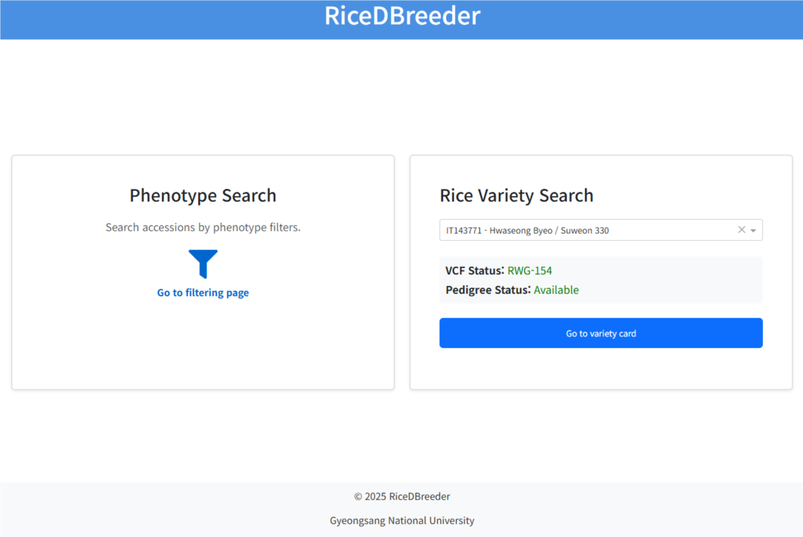
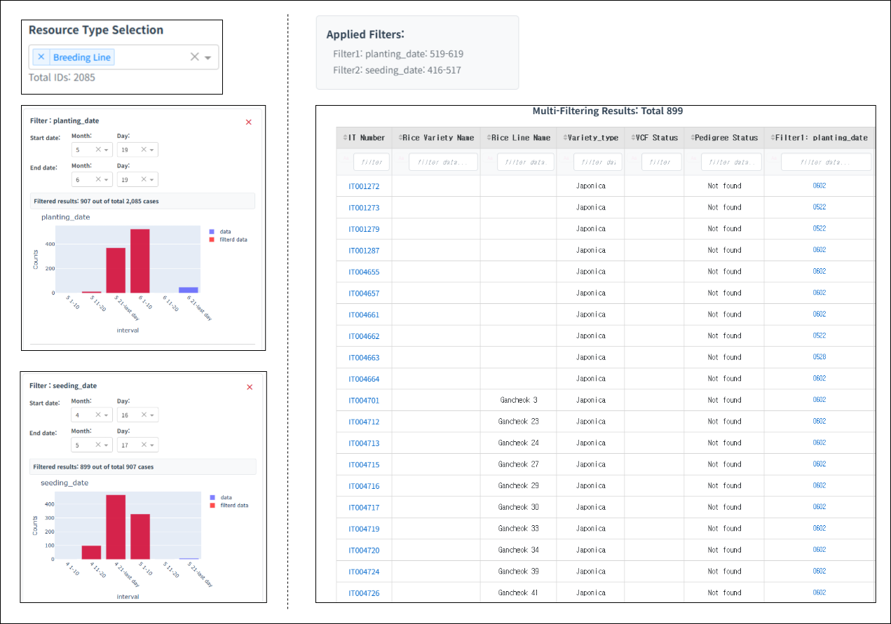
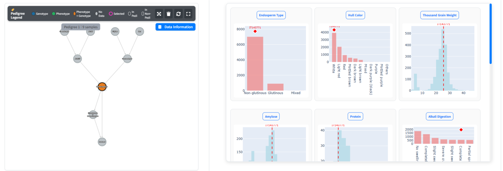
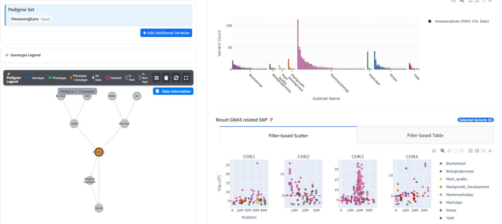
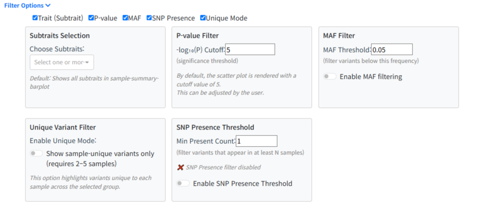
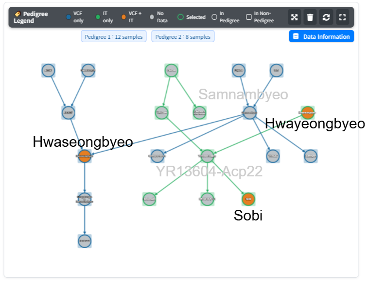
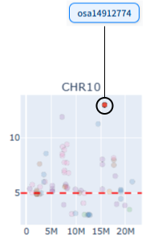
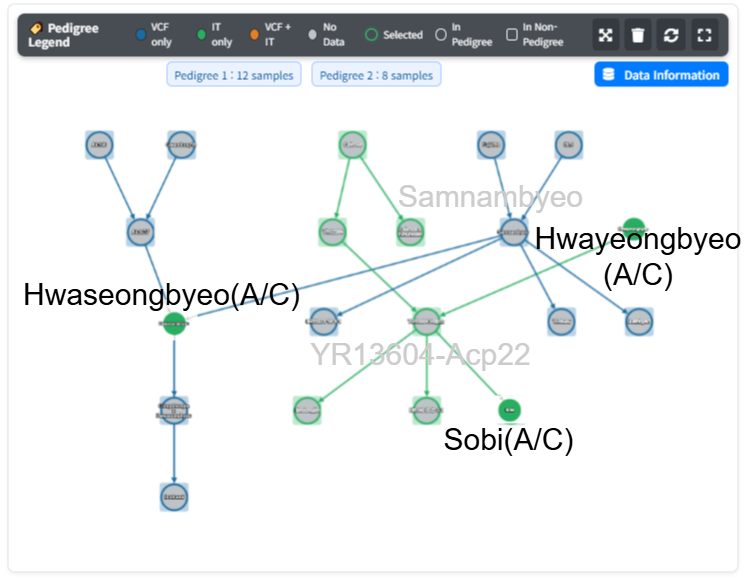
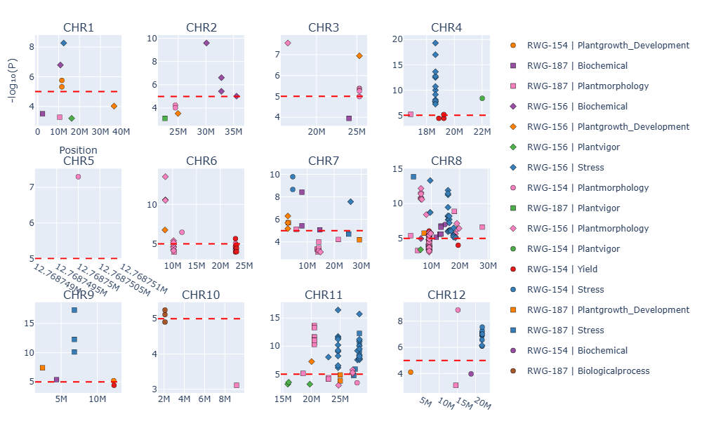
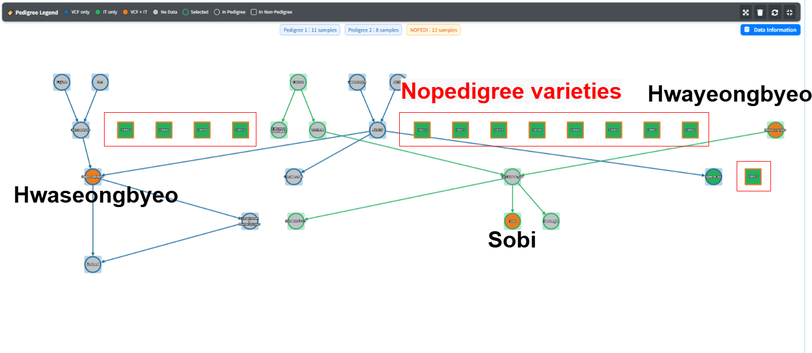

# RiceDBreeder-v1

Dockerized version of **RiceDBreeder** web applications.

---

## 🚀 Build & Run

From the project root, execute:

```bash
docker compose up -d
```

Then open your browser:

```
http://localhost:11028/
```

> ⚙️ If a port conflict occurs, edit the port in `docker-compose.yml` before running.

---

## 🌾 Overview

**RiceDBreeder** integrates three core data layers of Korean rice resources — **pedigree**, **phenotype**, and **genotype (VCF + GWAS)** — to support data-driven breeding decisions.
It bridges gaps caused by fragmented NGS data, separately stored phenotype records, and document-based pedigree archives, offering a unified visual interface for cross-layer exploration.

---

## 🏠 Home Interface

Two primary entry points:

* **Phenotype Search** — explore varieties by phenotype filters.
* **Rice Variety Search** — analyze a selected variety’s pedigree, phenotype, and genotype data.



---

## 🧩 Phenotype Search

Choose **resource type** (e.g., *Breeding Line, Cultivar, Germplasm, Landrace, Weedy Type*) and select traits such as `planting date` or `grain width`.
Distribution plots visualize value ranges and filtered subsets.
The filtered varieties appear in a table with direct access to the detailed variety view.



---

## 🌳 Rice Variety Search

The central analysis module for integrated **pedigree–phenotype–genotype** exploration.
Selecting a variety loads:

* **Pedigree Visualization (left)** — ±2 generations up and down.
* **Analysis Dashboard (right)** — toggles between *Phenotype* and *GWAS Analysis* tabs.



*Phenotype Analysis shows trait distributions (e.g., yield, hull color, amylose) with the base variety highlighted.*



*GWAS Analysis shows trait-linked SNPs by subtrait color across chromosomes.*

---

## 🧬 Filter Options (Genotype Module)

Users can control the displayed SNPs through flexible filters.

| Option                     | Description                                                                          |
| -------------------------- | ------------------------------------------------------------------------------------ |
| **Trait/Subtrait**         | Select domains (e.g., yield, stress, biochemical). Determines variant color mapping. |
| **P-value**                | Adjust statistical significance threshold (default -log₁₀P = 5).                     |
| **MAF Filter**             | Enable and set minor allele frequency cutoff (≥ 0.05 by default).                    |
| **SNP Presence Threshold** | Display variants appearing in ≥ N samples.                                           |
| **Unique Mode**            | Highlight variants unique to individual samples (requires 2–5 samples).              |



---
## Group Selection (3 types)

| Type                    | What it does                                                         | How to use (typical)                                                                                         |
|-------------------------|----------------------------------------------------------------------|--------------------------------------------------------------------------------------------------------------|
| **Trait grouping**      | Compare sets of traits under current filters.                        | In the **bar plot**, select traits → they are recorded in **Selected traits**. Assign these to **Group 1..k** to compare. |
| **Variant-ID grouping** | Build and compare variant sets from different presence thresholds.   | Example with **7 samples**: **Group 1 = Presence ≥4 (4–5)**, **Group 2 = Presence ≥6 (6–7)**; compare the sets.           |
| **Sample grouping**     | Compare groups and detect **group-unique** vs shared variants.       | Partition selected samples into groups (e.g., **3,3,1** or **4,3**; up to **5 groups**) and analyze.                     |

> **Note:** You can define up to **5 groups** total (across all grouping modes).


## 🌾 Pedigree Visualization

The pedigree dynamically renders ±2 generations of ancestors and descendants.

* **Color scheme:**
  🟦 Genotype only 🟩 Phenotype only 🟧 Both ⬜ No linked data
* **Shape:**
  Circle = pedigree-registered Square = unlinked sample

**Expandable** by left-clicking (one generation per click).
**Reset / Remove / Additional** controls allow customized exploration.

### Example: Multiple Pedigrees with Highlighted Connections

Each pedigree (e.g., *Pedigree 1*, *Pedigree 2*) is rendered with distinct edges for relationship tracing.



---

## 🎯 Variant Selection and Reflection

When a SNP is clicked in the scatter plot, the selected variant is highlighted,
and the corresponding varieties carrying the same genotype are visually reflected in the pedigree.

### Step 1 — Variant Selected



### Step 2 — Pedigree Highlight Updated



---

## 🌈 Unique Mode Visualization

When **Unique Mode** is enabled, variants unique to each sample are emphasized in the scatter plot.
Each point corresponds to a sample-specific variant, displayed in distinct colors and markers.



---

## 🌿 Handling Additional and No-Pedigree Cases

When users add varieties not linked to any known pedigree,
RiceDBreeder displays them as **NoPedigree Varieties** —
highlighted rectangular nodes visually separated from pedigree-linked groups.



---

## 🔁 Interaction Summary

* **Phenotype ↔ Pedigree linkage:** Trait selection colors nodes by values.
* **Genotype ↔ Pedigree linkage:** SNP selection highlights carriers in the network.
* **Bidirectional sync:** Any click event updates both plots and pedigree.
* **Expandable nodes:** Add or remove generations dynamically.
* **Add additional varieties:** Merge multiple pedigrees or add external varieties.

---

## ⚙️ Key Features

* Unified cross-layer exploration (Pedigree ↔ Phenotype ↔ Genotype)
* Interactive pedigree expansion and variant tracking
* Trait- and subtrait-level GWAS integration
* Unique variant highlighting and threshold-based filtering
* Seamless multi-variety comparison
* No-pedigree visualization for unlinked samples

---


